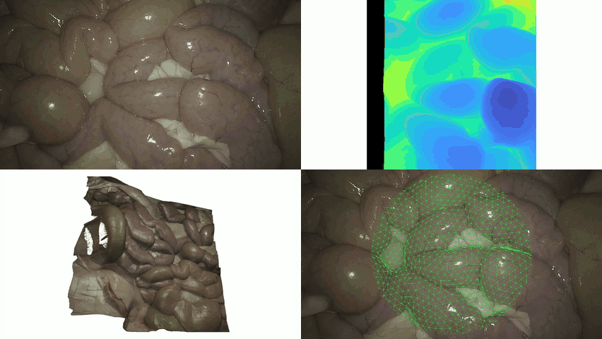

# A Fast Framework for Metric 3D Reconstructions and Vision-Based Tracking for Surgical Robotic Platforms

  

Juan Antonio Barragan†1, Brendan Burkhart†2, Balazs Vagvolgyi†2, Roger D. Soberanis-Mukul2,3, Mathias Unberath1, Peter Kazanzides1, and Emad Boctor2

† Equal contribution

*Submitted to Healthcare Technology Letters*

## Overview

This repository will host the code for a fast framework that gives surgical robotic platforms:

- **Metric 3D reconstruction** of the surgical scene using a Structure-from-Motion (SfM) pipeline.
- **Vision-based tracking** during surgery.

## Installation

TBD

## Usage

TBD

## Datasets

TBD

## Citation

TBD

## License

TBD
